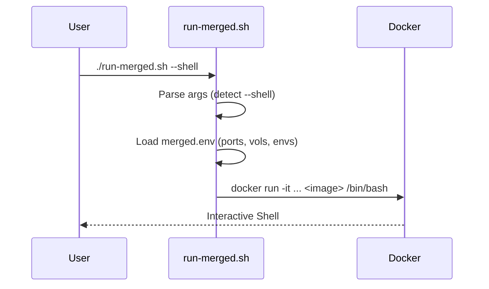

# Plan: Fix PeiDocker Runtime Issues (#5, #6)

## HEADER
- **Purpose**: Improve the default runtime behavior of PeiDocker projects by preventing Stage 1 startup during `compose up` and adding shell convenience to `run-merged.sh`.
- **Status**: Done
- **Date**: 2026-01-12
- **Completed**: 2026-01-20
- **Dependencies**: `src/pei_docker/templates/base-image-gen.yml`, `src/pei_docker/merge_build.py`
- **Target**: PeiDocker Users and Developers

---

## 1. Purpose and Outcome

The goal is to resolve two upstream issues that affect the "inner loop" of development:
1.  **Issue #6**: `docker compose up` currently starts both `stage-1` and `stage-2` containers. `stage-1` is typically an intermediate build stage and shouldn't run. We want `docker compose up` to only start `stage-2`.
2.  **Issue #5**: `run-merged.sh` (for standalone single-image builds) lacks a convenient way to drop into a shell and might not perfectly align with `stage-2` defaults. We want to add a `--shell` flag and ensure parity.

## 2. Implementation Approach

### 2.1 Fix #6: Default Stage 2 Startup
-   **Strategy**: Use Docker Compose **Profiles**.
-   **Mechanism**: Assign `stage-1` to a profile (e.g., `build-helper`) in the `base-image-gen.yml` template. Services assigned to profiles are not started by default `docker compose up` unless the profile is explicitly activated (`--profile build-helper`).
-   **Result**: `docker compose up` will ignore `stage-1` and only start `stage-2`. `docker compose build stage-1` will still work as expected.

### 2.2 Fix #5: Enhance run-merged.sh
-   **Strategy**: Modify the Python generator (`merge_build.py`) that creates `run-merged.sh`.
-   **Changes**:
    -   Update the bash script template inside `_write_run_script`.
    -   Add argument parsing for `-s` / `--shell`.
    -   If `--shell` is passed, override the container command to `/bin/bash` (or `sh`).
    -   Ensure the script consumes `merged.env` correctly to mirror the `docker-compose` environment.

### 2.3 Sequence Diagram (run-merged.sh --shell)

## 3. Files to Modify

*   **`src/pei_docker/templates/base-image-gen.yml`**
    *   Add `profiles: ["build-helper"]` to the `stage-1` service definition.
*   **`src/pei_docker/merge_build.py`**
    *   Update `_write_run_script` function to generate the enhanced bash script.

## 4. TODOs (Implementation Steps)

- [ ] **Fix Issue #6 (Compose Template)**
    - [ ] Modify `src/pei_docker/templates/base-image-gen.yml`.
    - [ ] Add `profiles: ["build-helper"]` to `stage-1` service.
    - [ ] Verify `docker compose up` only starts `stage-2` in a test project.

- [ ] **Fix Issue #5 (run-merged.sh)**
    - [ ] Modify `src/pei_docker/merge_build.py`.
    - [ ] Update bash generation string to include a `case` statement for `-s|--shell`.
    - [ ] Implement logic: if shell mode, append `/bin/bash` (or preferred shell) to the docker command.
    - [ ] Ensure `merged.env` loading logic is robust.

- [ ] **Verification**
    - [ ] Regenerate `dockers/infer-dev` config using the modified `pei-docker-cli` (installed in editable mode).
    - [ ] Run `docker compose up` -> verify only stage-2 starts.
    - [ ] Run `./run-merged.sh --shell` -> verify it opens a shell.
