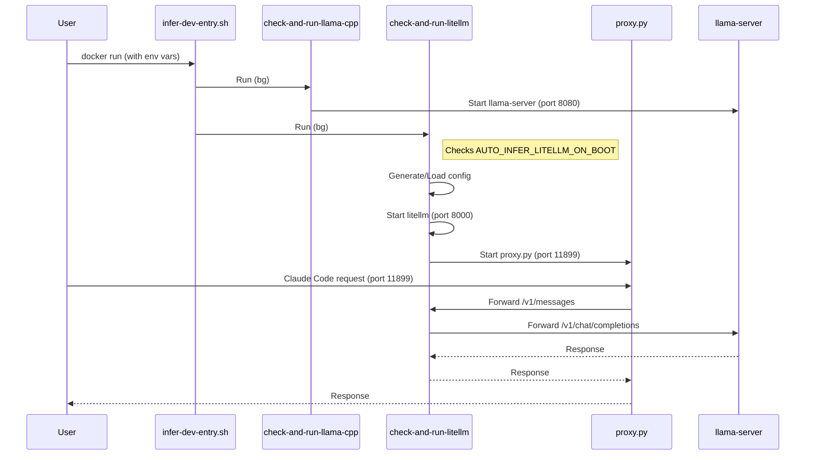

# Plan: Integrate LiteLLM and Claude Bridge into Infer-Dev

## HEADER
**Purpose**: Integrate `LiteLLM` and a telemetry proxy into the `infer-dev` Docker image to enable seamless support for `Claude Code` (Anthropic API) backed by local `llama.cpp` models.
**Status**: Done
**Date**: 2026-01-19
**Completed**: 2026-01-20
**Dependencies**: `dockers/infer-dev`, `llama.cpp` (installed in container), `uv` (installed in container).
**Target**: DevOps engineers and users of `infer-dev`.

---

## 1. Purpose and Outcome

The goal is to allow users to use `Claude Code` with local models running in `infer-dev` without manual setup of bridges.
This involves:
1.  **Installing LiteLLM**: Baking `litellm` and `requests` into the docker image.
2.  **Telemetry Proxy**: Including the python proxy script to handle `Claude Code` specific endpoints (e.g., `/api/event_logging/batch`).
3.  **Auto-Start Mechanism**: Providing a mechanism (env vars) to automatically start `litellm` and the proxy on container boot, chained after `llama-server`.

**Outcome**: A user can set `AUTO_INFER_LITELLM_ON_BOOT=1` and `AUTO_INFER_LITELLM_CONFIG=...` to have a ready-to-use Anthropic-compatible endpoint at port `11899`.

## 2. Implementation Approach

### 2.1 High-level flow

1.  **Installation**:
    - Add `install-litellm.sh` to `stage-2/system/litellm/`.
    - Install `litellm` via `uv tool install`.
    - Install `requests` via `uv pip install` (or into a specific venv for the proxy).
2.  **Scripts**:
    - Add `proxy.py` to `stage-2/system/litellm/`.
    - Add `check-and-run-litellm.sh` to `stage-2/system/litellm/` (symlinked to `/soft/app/litellm/`).
    - This script checks env vars, generates/loads config, and starts processes.
3.  **Entrypoint Integration**:
    - Modify `infer-dev-entry.sh` to call `check-and-run-litellm.sh` after `llama-server` checks.
4.  **Configuration**:
    - Support `AUTO_INFER_LITELLM_CONFIG` (path to config.yaml).
    - Support auto-generating a default config if missing (mapping `claude-*` to `openai/glm4`).

### 2.2 Sequence diagram (steady-state usage)

## 3. Files to Modify or Add

- **dockers/infer-dev/src/installation/stage-2/system/litellm/README.md**: Documentation.
- **dockers/infer-dev/src/installation/stage-2/system/litellm/install-litellm.sh**: Installation script.
- **dockers/infer-dev/src/installation/stage-2/system/litellm/proxy.py**: The telemetry proxy script.
- **dockers/infer-dev/src/installation/stage-2/custom/check-and-run-litellm.sh**: Project launcher script.
- **dockers/infer-dev/src/installation/stage-2/custom/infer-dev-entry.sh**: Update to call the new launcher.
- **dockers/infer-dev/src/user_config.yml**: Update to include the new installation script.
- **dockers/infer-dev/src/docker-compose.yml**: (Regenerated) Update ports/volumes if needed (expose 11899).

## 4. TODOs (Implementation Steps)

- [x] **Create Install Script**: `install-litellm.sh` to install `litellm[proxy]`.
- [x] **Create Proxy Script**: Save the `proxy.py` logic to `stage-2/system/litellm/proxy.py`.
- [x] **Create Launcher Script**: `check-and-run-litellm.sh` to handle config and process lifecycle.
- [x] **Update User Config**: Add `install-litellm.sh` to `on_build` in `user_config.yml`.
- [x] **Update Entrypoint**: Modify `infer-dev-entry.sh` to invoke `check-and-run-litellm.sh`.
- [x] **Regenerate Config**: Run `pei-docker-cli configure`.
- [x] **Rebuild Image**: Rebuild `infer-dev:stage-2`.
- [x] **Verify**: Test with `Claude Code` using the new auto-start feature.
