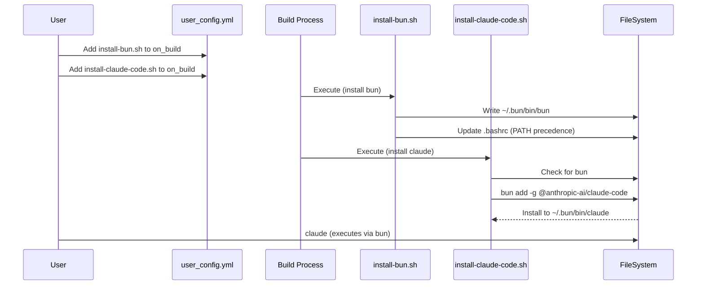

# Plan: Switch PeiDocker Agent Installation to Bun

## HEADER
- **Purpose**: Migrate Anthropic Claude Code and OpenAI Codex CLI installation from `npm` to `bun` in PeiDocker, while retaining `npm` for Node.js/NVM bootstrapping.
- **Status**: Done
- **Date**: 2026-01-13
- **Completed**: 2026-01-20
- **Dependencies**: 
    - `extern/tracked/PeiDocker/src/pei_docker/project_files/installation/stage-2/system/claude-code/install-claude-code.sh`
    - `extern/tracked/PeiDocker/src/pei_docker/project_files/installation/stage-2/system/codex-cli/install-codex-cli.sh`
    - `extern/tracked/PeiDocker/src/pei_docker/project_files/installation/stage-2/system/nodejs/install-nvm-nodejs.sh`
- **Target**: PeiDocker Developers and Users

---

## 1. Purpose and Outcome

The goal is to replace `npm install -g` with `bun add -g` for AI agent tools (`claude-code`, `codex-cli`, etc.) to improve installation speed and reliability. `npm` (via `nvm`) will still be used to install Node.js itself, as `bun` typically relies on a Node.js runtime for compatibility or is installed alongside it.

Key outcomes:
1.  **New Script**: `install-bun.sh` to install the Bun runtime.
2.  **Updated Scripts**: `install-claude-code.sh` and `install-codex-cli.sh` updated to use `bun add -g`.
3.  **Path Precedence**: Ensure Bun's global bin directory takes precedence over `npm`'s in `PATH`.

## 2. Implementation Approach

### 2.1 High-level flow

1.  **Create `install-bun.sh`**:
    -   Installs Bun using the official installer (curl script).
    -   Configures `PATH` in `.bashrc` (e.g., `~/.bun/bin`).
    -   Supports installation for specific users (like `install-pixi.bash` does).
2.  **Update Agent Installers**:
    -   Modify `install-claude-code.sh` and `install-codex-cli.sh`.
    -   Check for `bun`. If missing, fail or warn (require `install-bun.sh` first).
    -   Replace `npm install -g <pkg>@latest` with `bun add -g <pkg>@latest`.
    -   Ensure `PATH` includes Bun's bin directory during installation.
3.  **Update `install-nvm-nodejs.sh`** (Optional but recommended):
    -   Ensure it doesn't conflict with Bun. (Likely fine as they use different dirs).

### 2.2 Sequence Diagram (Steady-state usage)

## 3. Files to Modify or Add

*   **`extern/tracked/PeiDocker/src/pei_docker/project_files/installation/stage-2/system/bun/install-bun.sh`** (New)
    -   Script to install Bun.
    -   Must support `--user <username>` and `--install-dir`.
    -   **New**: Support `--npm-repo <url>` to configure the default registry in `~/.bunfig.toml`.
*   **`extern/tracked/PeiDocker/src/pei_docker/project_files/installation/stage-2/system/bun/README.md`** (New)
    -   Documentation for the new script.
*   **`extern/tracked/PeiDocker/src/pei_docker/project_files/installation/stage-2/system/claude-code/install-claude-code.sh`** (Modify)
    -   Switch command to `bun add -g`.
*   **`extern/tracked/PeiDocker/src/pei_docker/project_files/installation/stage-2/system/codex-cli/install-codex-cli.sh`** (Modify)
    -   Switch command to `bun add -g`.

## 4. TODOs (Implementation Steps)

- [ ] **Create Bun Installer**
    - [ ] Create directory `stage-2/system/bun`.
    - [ ] Implement `install-bun.sh` with `--user` support.
    - [ ] Implement `--npm-repo` support: write to `~/.bunfig.toml`.
    - [ ] Ensure `~/.bun/bin` is added to `PATH` in `.bashrc` *before* other node paths if possible.
    - [ ] Add `README.md`.

- [ ] **Update Claude Code Installer**
    - [ ] Modify `install-claude-code.sh` to require `bun`.
    - [ ] Change installation command to `bun add -g @anthropic-ai/claude-code@latest`.
    - [ ] Verify `claude` command availability.

- [ ] **Update Codex CLI Installer**
    - [ ] Modify `install-codex-cli.sh` to require `bun`.
    - [ ] Change installation command to `bun add -g @openai/codex@latest`.

- [ ] **Verification**
    - [ ] Create a minimal test project in `tmp/bun-test`.
    - [ ] Use `ubuntu:24.04` as the base image.
    - [ ] **Configure Proxy**: Set `proxy.address: host.docker.internal` and `proxy.port: 7890`. Enable globally if needed.
    - [ ] **Configure APT**: Set `apt.repo_source: aliyun` and `apt.use_proxy: false`.
    - [ ] Configure `user_config.yml` to install `bun`, `claude-code`, and `codex-cli`.
    - [ ] Run `pei-docker-cli configure` and `docker compose build`.
    - [ ] Verify `bun`, `claude`, and `codex` work in the container.
