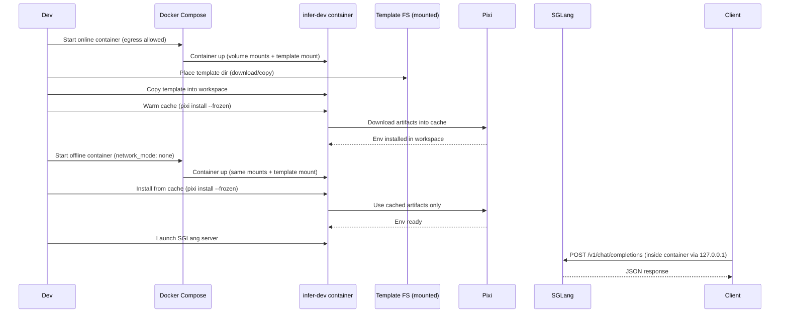

# Plan: Add runtime offline SGLang install + auto-serve for infer-dev (no pixi-pack)

## HEADER

- **Purpose**: Add an opt-in mechanism in `dockers/infer-dev` to (1) install SGLang + CUDA-enabled PyTorch at runtime using Pixi (not baked into the image) and (2) start one or more SGLang OpenAI-compatible servers from a config on container boot or manually after boot, while supporting a strict “no network egress” offline test. The Pixi project template (manifest + lock) is also not baked into the image; it is provided at runtime from a downloaded directory (local disk or network filesystem) mounted into the container.
- **Status**: Draft
- **Date**: 2026-01-23
- **Dependencies**:
  - `dockers/infer-dev/src/installation/stage-2/custom/infer-dev-entry.sh` (boot hook wiring pattern)
  - `dockers/infer-dev/src/installation/stage-2/system/pixi/install-pixi.bash` (Pixi availability in stage-2)
  - `context/plans/done/plan-auto-install-llama-cpp-pkg-on-boot.md` (boot-time “install package then optionally serve” contract)
  - `context/plans/plan-add-vllm-package-auto-infer-infer-dev.md` (overall “runtime install + serve” design)
- `dockers/infer-dev/sub-projects/sglang-infer/pixi.toml` (Pixi manifest that pins CUDA-specific PyTorch wheels)
- `dockers/infer-dev/sub-projects/sglang-infer/pixi.lock` (lockfile used for reproducible installs)
- `dockers/infer-dev/sub-projects/sglang-infer/scripts/smoke-qwen2-vl-7b-cu128.sh` (real request test)
- `dockers/infer-dev/sub-projects/sglang-infer/scripts/report-qwen2-vl-7b.md` (evidence capture format)
  - `context/hints/howto-host-glm-4-7-with-sglang-on-cuda-12-6.md` (GLM-4.7 flags + baseline guidance)
  - SGLang docs (keep verifying install + server args against latest):
    - https://docs.sglang.ai/start/install/
    - https://docs.sglang.ai/references/server_arguments/
  - PyTorch / CuDNN compatibility note (torch `2.9.1` + CuDNN < 9.15): https://github.com/pytorch/pytorch/issues/168167
- **Target**: AI engineers using `dockers/infer-dev` for local GPU inference who want SGLang available without making the Docker image heavy and still usable in offline environments.

---

## 1. Purpose and Outcome

Success looks like:

- `infer-dev:stage-2` remains lightweight: it includes Pixi and small helper scripts/config templates, but does not include SGLang, FlashInfer, Torch wheels, or model weights.
- Users can choose one of two installation modes (both install at runtime into the workspace, not the image):
  1. **On-boot install**: set env vars and mount a prepared cache; the container installs SGLang into a workspace-backed location and optionally starts serving.
  2. **Manual install**: after boot, users run `/soft/app/sglang/*` helpers to install/update the environment and then start serving.
- The SGLang Pixi template (manifest + lock, no `.pixi/`, no caches) is provided at runtime (downloaded to the host or a network filesystem and mounted into the container), then copied into the workspace as the “working Pixi project”.
- Offline correctness is enforced by a **no-egress test**: when the container network is disabled, `pixi install --frozen` still succeeds as long as the cache is present.
- A documented config works for at least one model we can validate locally (`models/qwen2-vl-7b`), and the validation includes a real request to `/v1/chat/completions` with a non-empty response.
  - This plan targets **cu128 only**; the default Pixi environment is cu128.

Non-goals (for this initial plan):

- Building SGLang from source in-container by default (keep source-build as an explicit opt-in fallback).
- Multi-node orchestration (leave that to SGLang’s own `--dist-init-addr/--nnodes` workflows).

## 2. Implementation Approach

### 2.1 High-level flow (no pixi-pack; cache-based offline installs)

This plan replaces the previous `pixi-pack`-bundle approach with a simpler contract:

- Provide a tiny Pixi project template (manifest + lock) at runtime (downloaded and mounted).
- Warm caches once on an online machine/container.
- Reuse those caches on the offline machine/container with network disabled.

Flow:

1. **Provide a tiny “SGLang Pixi project template” at runtime (not in the image)**:
   - The template is a directory containing at least:
     - `pixi.toml`
     - `pixi.lock`
     - optional helper scripts (e.g. smoke tests)
   - This repo already has a suitable template at `dockers/infer-dev/sub-projects/sglang-infer/`, but in the intended workflow that directory is part of a separate downloadable artifact (copied to local disk or stored on a network filesystem), then mounted into the container.
   - The template defines a **single default Pixi environment** targeting **cu128** (CUDA 12.8 PyTorch wheels).
   - Non-goal: cu126 support (we intentionally do not support it in this plan).

2. **Use a workspace-backed cache directory that can be warmed once and reused**:
   - Do not assume a fixed mount path (K8s or other runtimes may mount volumes at different container paths, sometimes known ahead of time, sometimes provided via env vars).
   - Define a **path contract via env vars** (with sensible defaults for offline-first/K8s usage):
     - `AUTO_INFER_WORKSPACE_DIR` (default: `/offline-data`)
     - `AUTO_INFER_SGLANG_PROJECT_DIR` (default: `${AUTO_INFER_WORKSPACE_DIR}/sglang-infer`)
     - `AUTO_INFER_SGLANG_CACHE_ROOT` (default: `${AUTO_INFER_WORKSPACE_DIR}/.cache/sglang-infer`)
   - Allow caches to be mounted independently of the workspace by overriding `AUTO_INFER_SGLANG_CACHE_ROOT`.
   - Cache persistence requirements:
     - `${AUTO_INFER_SGLANG_CACHE_ROOT}` must be a persistent mount (hostPath/PVC/NFS/etc) so it survives **docker image rebuilds** and **container recreation**.
     - Do not store caches on the container writable layer or in the image filesystem.
   - The helper scripts always set cache env vars derived from `AUTO_INFER_SGLANG_CACHE_ROOT`:
     - `RATTLER_CACHE_DIR=${AUTO_INFER_SGLANG_CACHE_ROOT}/conda/rattler`
     - `UV_CACHE_DIR=${AUTO_INFER_SGLANG_CACHE_ROOT}/pypi/uv`
     - `PIXI_CACHE_DIR=${AUTO_INFER_SGLANG_CACHE_ROOT}/pixi`
     - `XDG_CACHE_HOME=${AUTO_INFER_SGLANG_CACHE_ROOT}/xdg`
   - The installed Pixi environment prefix remains under `${AUTO_INFER_SGLANG_PROJECT_DIR}/.pixi/envs/<env>` (expected).

3. **Two-phase workflow: warm cache online → install offline**:
   - Phase A (online, with network): warm caches inside a container while ensuring everything downloaded/built is written into a mounted directory so it persists on the host (or a persistent volume) and can be reused across tests.
     - Requirements:
       - `${AUTO_INFER_SGLANG_CACHE_ROOT}` must be on a mounted/persistent path (hostPath/PVC/NFS/etc), not on the container’s writable layer, and must survive **image rebuilds** and **container recreation**.
       - `${AUTO_INFER_SGLANG_PROJECT_DIR}` should also be on a mounted/persistent path so `.pixi/envs/...` survives container recreation (keeps “offline” runs fast and reproducible).
     - Proxy usage for warming:
       - If the host has proxy env vars, propagate them into the container environment for the warm-cache step (and only that step): `HTTP_PROXY`, `HTTPS_PROXY`, `ALL_PROXY`, `NO_PROXY` (and lowercase variants if needed).
       - The warm-cache helper should *not* invent proxy values; it should read them from the container env (set by Compose/K8s) and export them for `pixi`/`uv`.
     - Action:
       - Copy template into `${AUTO_INFER_SGLANG_PROJECT_DIR}` and run `pixi install --frozen` (default env) once to populate caches.
   - Phase B (offline, no egress): run `pixi install --frozen` again; it should succeed without downloading anything because the caches already contain the artifacts referenced by `pixi.lock`.
     - In offline validation, explicitly unset proxy env vars (and disable network egress) to ensure the test is real: run the install/start commands under `env -u HTTP_PROXY -u HTTPS_PROXY -u ALL_PROXY -u NO_PROXY -u http_proxy -u https_proxy -u all_proxy -u no_proxy ...`.

4. **Boot-time auto-install and auto-serve (opt-in)**:
   - Add a boot hook that, when enabled, does:
     1) install (from cache) into `${AUTO_INFER_SGLANG_PROJECT_DIR}`
     2) start one or more SGLang servers (config-driven)

5. **Manual mode remains supported**:
   - Developers can `docker exec` into the container, run the install helper, then run a manual serve command (or a smoke test script).

### 2.2 Sequence diagram (steady-state usage)

### 2.3 Key constraints and known issues (must be addressed explicitly)

1. **No baked inference engines**:
   - The image must not include SGLang/Torch wheels/FlashInfer; those must be installed into the workspace at runtime.
   - Only template files + scripts may be shipped inside `installation/stage-2/*`.

2. **Offline correctness is not “best effort”**:
   - We must validate offline by disabling container networking and proving:
     - `pixi install --frozen` succeeds
     - serving succeeds
     - a real request returns a valid response

3. **Proxy must not leak into offline tests**:
   - In test commands, always run with proxy vars removed (`env -u HTTP_PROXY -u HTTPS_PROXY -u ALL_PROXY ...`) so “offline” isn’t bypassed by a local proxy.

4. **PyTorch 2.9.1 + CuDNN compatibility check (SGLang)**:
   - SGLang blocks torch `2.9.1` when `torch.backends.cudnn.version() < 9.15` due to a known Conv3d bug.
   - The PyTorch CUDA wheels for torch `2.9.1+cu12*` currently depend on `nvidia-cudnn-cu12==9.10.2.21` (so you can’t “just upgrade” it via normal dependency resolution).
   - Conda-forge CuDNN 9.16+ currently requires CUDA 13+ (so adding a conda-forge `cudnn>=9.16` dependency while keeping `cuda-version==12.6` is not solvable).
   - This plan must explicitly choose one of:
     - **Fast path**: set `SGLANG_DISABLE_CUDNN_CHECK=1` (acceptable only if we document the risk and keep it scoped to dev/testing), or
     - **Safer path**: move to a torch/sglang stack that does not require torch `2.9.1`, or
     - **Advanced**: implement an explicit CuDNN override strategy and validate it offline.

## 3. Files to Modify or Add

- **`dockers/infer-dev/src/installation/stage-2/custom/sglang/sglang-env.sh`**: Normalizes `AUTO_INFER_WORKSPACE_DIR` / `AUTO_INFER_SGLANG_PROJECT_DIR` / `AUTO_INFER_SGLANG_CACHE_ROOT` and exports cache env vars derived from `AUTO_INFER_SGLANG_CACHE_ROOT`.
- **`dockers/infer-dev/src/installation/stage-2/custom/sglang/copy-sglang-template-into-workspace.sh`**: Copies a runtime-provided template dir into `${AUTO_INFER_SGLANG_PROJECT_DIR}` (idempotent; refuses if missing).
- **`dockers/infer-dev/src/installation/stage-2/custom/sglang/warm-sglang-cache.sh`**: Online-only helper that runs `pixi install --frozen` (both envs) to populate caches under the workspace.
- **`dockers/infer-dev/src/installation/stage-2/custom/sglang/install-sglang-from-cache.sh`**: Offline installer that runs `pixi install --frozen` with cache env vars forced via `AUTO_INFER_SGLANG_CACHE_ROOT`.
- **`dockers/infer-dev/src/installation/stage-2/custom/sglang/check-and-run-sglang.sh`**: Config-driven runner that launches SGLang servers and writes per-instance logs under the workspace.
- **`dockers/infer-dev/src/installation/stage-2/custom/infer-dev-entry.sh`**: Wire `/soft/app/sglang/*` helpers and env-gated boot hooks.
- **`dockers/infer-dev/model-configs/sglang-*.toml`**: Example configs (e.g., `sglang-glm-4.7-tp8.toml`, `sglang-qwen2-vl-7b-tp2.toml`).
- **`dockers/infer-dev/docker-compose.offline.yml`**: Override to set `network_mode: none` for strict no-egress validation.
- **`dockers/infer-dev/docker-compose.sglang-template.yml`** (new): Compose override that mounts the downloaded template directory into the container at a stable path (chosen by the operator, and passed as `AUTO_INFER_SGLANG_TEMPLATE_DIR`).
- **`dockers/infer-dev/README.md`**: Document cache warming, offline install, auto-serve, and offline test commands.
- **`dockers/infer-dev/docs/tutorial/offline-sglang-on-infer-dev/README.md`**: Update tutorial to use this cache-based approach (not pixi-pack).
- **`dockers/infer-dev/docs/tutorial/offline-sglang-on-infer-dev/testplan-*.md`**: Add/update test plan to enforce no egress and to capture per-step reports/logs.

## 4. TODOs (Implementation Steps)

- [ ] **Freeze a known-good SGLang/PyTorch matrix (cu128 only)** Pin a known-good cu128 stack (based on current SGLang docs + local GPU tests), and explicitly decide how to handle the torch `2.9.1` CuDNN check (disable check vs change stack vs override CuDNN).
- [ ] **Define template delivery contract** Decide where the runtime-provided template lives in the container (mounted from local disk or a network filesystem), and define env vars:
  - [ ] `AUTO_INFER_SGLANG_TEMPLATE_DIR=/path/in/container` (required)
  - [ ] `AUTO_INFER_WORKSPACE_DIR=/path/in/container` (optional; default `/offline-data`)
  - [ ] `AUTO_INFER_SGLANG_PROJECT_DIR=${AUTO_INFER_WORKSPACE_DIR}/sglang-infer` (optional)
  - [ ] `AUTO_INFER_SGLANG_CACHE_ROOT=${AUTO_INFER_WORKSPACE_DIR}/.cache/sglang-infer` (optional; supports separate cache mount)
  - [ ] `AUTO_INFER_SGLANG_PIXI_ENV=default` (optional; default `default` which is cu128 in this plan)
- [ ] **Implement cache env contract** Add `dockers/infer-dev/src/installation/stage-2/custom/sglang/sglang-env.sh` and ensure all related scripts source it.
- [ ] **Implement copy-template helper** Add `dockers/infer-dev/src/installation/stage-2/custom/sglang/copy-sglang-template-into-workspace.sh`:
  - [ ] Fail-fast if `AUTO_INFER_SGLANG_TEMPLATE_DIR` is missing or does not contain `pixi.toml` + `pixi.lock`.
  - [ ] Copy into `AUTO_INFER_SGLANG_PROJECT_DIR` when missing or when `AUTO_INFER_SGLANG_FORCE_RECOPY=1`.
- [ ] **Implement warm-cache helper (online)** Add `dockers/infer-dev/src/installation/stage-2/custom/sglang/warm-sglang-cache.sh`:
  - [ ] Runs `copy-sglang-template-into-workspace.sh` first.
  - [ ] Writes all downloads into `${AUTO_INFER_SGLANG_CACHE_ROOT}` (must be a mounted/persistent path).
  - [ ] If proxy env vars are present in the container, pass them through to `pixi`/`uv` (`HTTP_PROXY`/`HTTPS_PROXY`/`ALL_PROXY`/`NO_PROXY`).
  - [ ] Run `pixi install --frozen` (default env).
  - [ ] Emit a short “cache manifest” file (e.g. lockfile hash + timestamps) under `${AUTO_INFER_SGLANG_CACHE_ROOT}/`.
- [ ] **Implement install-from-cache helper (offline)** Add `dockers/infer-dev/src/installation/stage-2/custom/sglang/install-sglang-from-cache.sh`:
  - [ ] Runs `copy-sglang-template-into-workspace.sh` first.
  - [ ] Refuse to run if caches are missing (fail-fast with a clear message).
  - [ ] Run `pixi install --frozen` (default env; cu128).
  - [ ] Run a minimal import check and print torch/sglang versions and `torch.cuda.is_available()`.
- [ ] **Implement server runner (config-driven)** Add `dockers/infer-dev/src/installation/stage-2/custom/sglang/check-and-run-sglang.sh`:
  - [ ] Accept config path via env var (e.g. `AUTO_INFER_SGLANG_CONFIG=${AUTO_INFER_WORKSPACE_DIR}/sglang-configs/sglang-qwen2-vl-7b-tp2.toml`).
  - [ ] Launch one or more servers; per server:
    - [ ] set `CUDA_VISIBLE_DEVICES` from config
    - [ ] write logs under `${AUTO_INFER_WORKSPACE_DIR}/logs/sglang/...`
    - [ ] verify readiness by polling `/v1/models`
- [ ] **Wire boot hooks (opt-in)** Update `dockers/infer-dev/src/installation/stage-2/custom/infer-dev-entry.sh`:
  - [ ] `AUTO_INFER_SGLANG_CACHE_WARM_ON_BOOT=1` (optional; online only)
  - [ ] `AUTO_INFER_SGLANG_INSTALL_ON_BOOT=1` (offline-capable)
  - [ ] `AUTO_INFER_SGLANG_ON_BOOT=1` (starts server after install)
- [ ] **Add template mount override** Add `dockers/infer-dev/docker-compose.sglang-template.yml`:
  - [ ] Mount `HOST_VOLUME_SGLANG_TEMPLATE_DIR` into the container at the chosen `AUTO_INFER_SGLANG_TEMPLATE_DIR`.
  - [ ] Keep `env.example` updated with `HOST_VOLUME_SGLANG_TEMPLATE_DIR` if needed.
- [ ] **Add strict offline compose override** Add `dockers/infer-dev/docker-compose.offline.yml`:
  - [ ] Set `network_mode: none` for the test service.
  - [ ] Remove/ignore host port mappings for that offline test service (requests will be made via `docker exec` inside the container).
- [ ] **Write and run an offline test plan** Update `dockers/infer-dev/docs/tutorial/offline-sglang-on-infer-dev/testplan-*.md` to:
  - [ ] Warm cache online once
  - [ ] Restart with `network_mode: none` (no egress)
  - [ ] Install from cache
  - [ ] Launch server for `models/qwen2-vl-7b`
  - [ ] Send a real `/v1/chat/completions` request and record response JSON
  - [ ] Capture evidence (per-step report files + `nvidia-smi` logs) and track docker resources created for cleanup
