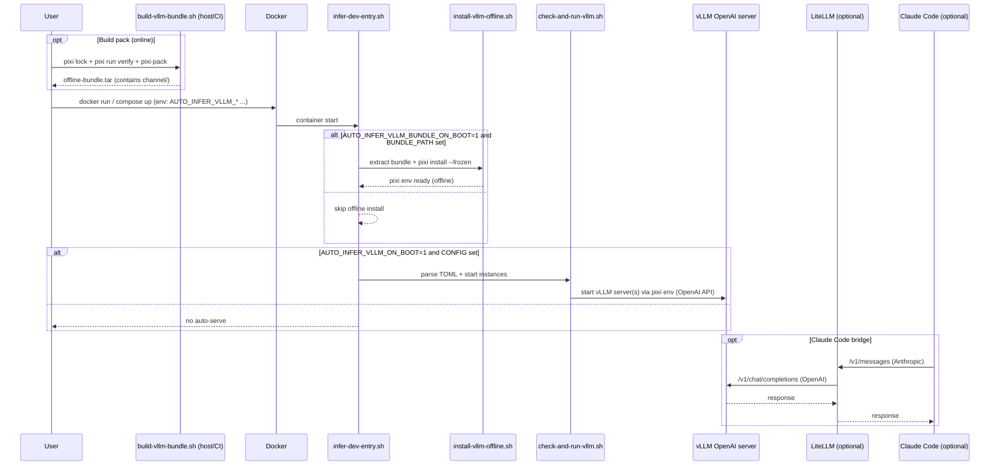

# Plan: Add vLLM Pixi-Pack offline bundle + auto-serve for infer-dev

## HEADER
**Purpose**: Add an opt-in mechanism in `dockers/infer-dev` to (1) build and validate a vLLM environment using **Pixi** (conda-forge-first) and **Pixi Pack** (`pixi-pack`) and (2) start one or more vLLM OpenAI-compatible servers from a TOML config on container boot using an **offline bundle** (local `channel/` + `pixi install --frozen`).
**Status**: Draft
**Date**: 2026-01-20
**Dependencies**:
- `dockers/infer-dev/installation/stage-2/custom/infer-dev-entry.sh`
- `dockers/infer-dev/installation/stage-2/custom/check-and-run-llama-cpp.sh` (pattern for TOML -> multi-instance runner)
- `dockers/infer-dev/installation/stage-2/system/pixi/install-pixi.bash` (Pixi availability in stage-2)
- `context/hints/howto-move-pixi-environment-offline.md` (Pixi Pack offline workflow)
- `dockers/infer-dev/model-configs/` (config examples)
- `dockers/infer-dev/README.md` (usage docs)
- `dockers/infer-dev/merged.env` + `dockers/infer-dev/run-merged.sh` (port exposure contract for `docker run`)
- `context/hints/howto-use-claude-code-with-local-models.md` (Claude bridge usage)
**Target**: AI engineers using `dockers/infer-dev` for local inference (vLLM + Claude Code via LiteLLM).

---

## 1. Purpose and Outcome

### What success looks like
- Users can build a reproducible **vLLM offline bundle** from a Pixi project:
  - create/update `pixi.toml` + `pixi.lock`,
  - validate vLLM import + basic server startup inside the same CUDA base,
  - run `pixi-pack` to produce an offline bundle tar containing `channel/` + metadata for the target platform.
- Users can start `infer-dev` with env vars that:
  - extract the offline bundle into a stable project dir (idempotent),
  - run `pixi install --frozen` against the extracted local `./channel` (no remote downloads),
  - and start one or more vLLM OpenAI API servers (per-TOML instance) on container boot.
- vLLM and binary deps are sourced primarily from **conda-forge** (via Pixi lock), minimizing “pip wheel + system lib” issues. Pip can still be used, but only inside the Pixi workflow that produces a lock/pack (not at runtime).
- The runner supports **multi-instance** configs with:
  - global defaults + per-instance overrides,
  - per-instance `CUDA_VISIBLE_DEVICES` selection,
  - log file/dir control,
  - background mode.
- The vLLM endpoint can be used directly (OpenAI format) or as the backend for the existing LiteLLM+Claude bridge (by setting `AUTO_INFER_LITELLM_BACKEND_BASE` accordingly).
- If desired, vLLM is exposed on a predictable host port via `merged.env`/`run-merged.sh` (proposed defaults: container `8000`, host `11981`).
- A “test model” (e.g. Qwen2-VL-7B-Instruct) is reachable via a stable mount path inside infer-dev for validation.

### Assumptions to confirm (if wrong, adjust plan)
- `pixi-pack` is available (installed via `pixi global install pixi-pack`, or available via `pixi exec`).
- The pack is built for `linux-64` and consumed on `linux-64` only (platform must match).
- The target container must work without hitting the network on boot; installing/running must not require remote channel access.
- Avoid (or be very deliberate about) pip-injected wheels: docs note unpacking can’t verify wheel compatibility with the target env; prefer conda-forge packages when possible.
- Pixi uses a shared global cache for downloaded conda packages and repodata (shown by `pixi info` as `Cache dir`, default: `$HOME/.cache/rattler/cache`).
- Pixi’s cache includes multiple sub-caches (notably `pkgs/` for downloaded/unpacked conda packages and `repodata/` for channel metadata; `uv-cache/` is used when PyPI deps are involved).
- `pixi-pack` supports a dedicated package cache via `--use-cache <dir>` (example in docs: `pixi-pack pack --use-cache ~/.pixi-pack/cache ...`). The cache follows the same structure as conda channels (`linux-64/`, `noarch/`, `repodata.json`) and can be reused across repeated pack builds.

## 2. Implementation Approach

### 2.1 High-level flow
0. **Build & pack offline bundle (host-side / CI, online)**:
   - In a Pixi project directory (proposed repo template path: `dockers/infer-dev/vllm-pixi/`):
     - `pixi lock` to produce/refresh `pixi.lock`.
      - `pixi run` a small validation task (import `torch`, `vllm`, print versions; optional short server warmup).
     - Run `pixi-pack` to produce an offline bundle tar (recommended: use a shared cache via `--use-cache`):
       - Verified CLI shape (pixi-pack 0.8.x): `pixi-pack -o <out.tar> --use-cache <dir> <project_dir_or_pixi.toml>`
       - The output is a tar archive containing:
         - `channel/` (with `linux-64/`, `noarch/`, `repodata.json`, and package artifacts),
         - `environment.yml`,
         - `pixi-pack.json`.
1. **Extract bundle + install offline (optional, on boot)**:
   - If `AUTO_INFER_VLLM_BUNDLE_ON_BOOT=1|true` and `AUTO_INFER_VLLM_BUNDLE_PATH=/path/to/offline-bundle.tar` is set:
      - extract into a stable Pixi project dir (default proposal: `/hard/volume/workspace/vllm-pixi-offline`),
      - ensure the project dir contains:
        - `pixi.toml` + `pixi.lock` (copied from the repo template),
        - `channel/` (from the bundle),
      - patch `pixi.toml` channels to `["./channel"]` (so Pixi never needs remote channels on boot),
      - run `pixi install --frozen --manifest-path <project_dir>`.
2. **Expose helpers under `/soft/app/vllm/`**:
   - Provide convenience scripts:
     - `/soft/app/vllm/install-vllm-offline.sh` (extract bundle + `pixi install --frozen` + verify)
     - `/soft/app/vllm/check-and-run-vllm.sh` (parse TOML + start instances)
3. **Auto-serve (optional, on boot)**:
   - If `AUTO_INFER_VLLM_ON_BOOT=1|true` and `AUTO_INFER_VLLM_CONFIG=/path/to/config.toml` exists:
     - parse TOML config (Python `tomllib`) into a list of instance launch specs,
     - resolve the Pixi project directory,
     - start each enabled instance with correct env + logging using `pixi run --manifest-path <project_dir> ...`.
4. **Manual usage**:
   - Users can run `/soft/app/vllm/install-vllm-offline.sh` and `/soft/app/vllm/check-and-run-vllm.sh` inside the container after boot.

### 2.2 Sequence diagram (steady-state usage)

### 2.3 Configuration (TOML) contract (proposal)
- `AUTO_INFER_VLLM_CONFIG` points to a TOML file with:
  - `[master] enable=true|false`
  - Optional `master.pixi_project_dir` (Pixi project dir containing `pixi.toml`, `pixi.lock`, and installed env)
  - Optional `master.pixi_environment` (default: `default`)
  - `[instance.control]` global defaults: `log_dir`, `background`, `gpu_ids`
  - `[instance.server]` global defaults: `host`, `port`, `model`, `dtype`, `tensor_parallel_size`, `max_model_len`, `api_key` (if needed), plus `extra_args = [...]`
  - `[instance.<name>.control]` and `[instance.<name>.server]` overrides

### 2.4 Cache strategy (avoid re-downloads during testing)

This plan should make it cheap to iterate on the Pixi project and rebuild packs without re-downloading large CUDA/PyTorch artifacts.

- **Pixi cache (rattler)**:
  - Persist Pixi’s default cache directory (as shown by `pixi info`) so `pixi lock/install/run` can reuse downloaded packages and repodata across runs.
  - Default on Linux: `$HOME/.cache/rattler/cache`
  - infer-dev recommendation: bind-mount a persistent workspace path to the runtime user’s cache dir:
    - `/hard/volume/workspace/.cache/rattler/cache` ↔ `$HOME/.cache/rattler/cache`
- **Pixi global data** (optional but helpful):
  - Set `PIXI_HOME` to a persistent location (e.g. `/hard/volume/workspace/.pixi`) so `pixi global install pixi-pack` does not re-download tools during testing.
- **pixi-pack cache**:
  - Always build packs with `pixi-pack ... --use-cache <dir>` and mount that cache directory persistently.
  - Proposed default: `/hard/volume/workspace/.cache/pixi-pack` (separate from rattler cache; structure resembles a local conda channel with `linux-64/`, `noarch/`, `repodata.json`).
- **Build scripts behavior**:
  - `build-vllm-bundle.sh` should:
    - accept `--pixi-cache-dir` and `--pixi-pack-cache-dir`,
    - default them to the persistent workspace paths above,
    - bind-mount the Pixi cache dir into any builder container (if the builder runs in-container),
    - export `PIXI_HOME` for subprocesses (optional),
    - and pass `--use-cache` to `pixi-pack`.
  - The smoke-test workflow should run the builder twice and assert the second run hits cache (log-level check), to prevent regressions where we accidentally bypass caches.

## 3. Files to Modify or Add

- **`dockers/infer-dev/host-scripts/build-vllm-bundle.sh`**: Build vLLM offline bundle (Pixi lock + verify + `pixi-pack`) and output `offline-bundle.tar` (contains `channel/`).
- **`dockers/infer-dev/installation/stage-2/custom/install-vllm-offline.sh`**: Extract an offline bundle tar into a stable Pixi project dir, patch channels to local only, run `pixi install --frozen`, verify imports, write `.installed-from.json`.
- **`dockers/infer-dev/installation/stage-2/custom/check-and-run-vllm.sh`**: Parse TOML and launch one/many vLLM servers via `pixi run --manifest-path ...` (per-instance GPU/log handling).
- **`dockers/infer-dev/installation/stage-2/custom/infer-dev-entry.sh`**: Call vLLM installer and runner based on env vars; add `/soft/app/vllm/*` symlinks.
- **`dockers/infer-dev/vllm-pixi/pixi.toml`**: Default Pixi project template (channels, Python, CUDA/PyTorch, vLLM deps, verify tasks).
- **`dockers/infer-dev/vllm-pixi/pixi.lock`** (recommended): Lockfile used by `pixi-pack` to generate the runtime pack.
- **`dockers/infer-dev/model-configs/vllm-*.toml`**: Example vLLM instance configs (at least one).
- **`dockers/infer-dev/README.md`**: Document env vars, Pixi Pack runtime contract, ports, and example commands.
- **`dockers/infer-dev/merged.env`**: Add `RUN_PORTS` entry for vLLM (and optional `HOST_PORT_VLLM` / `CONTAINER_PORT_VLLM` knobs if this repo’s infer-dev contract adopts them).
- **`context/design/contract/def-vllm-config-toml.md`** (new): Document TOML schema and examples (mirrors llama.cpp contract style).
- **`context/design/contract/vllm-config-toml.schema.json`** (new, optional): JSON schema for validation tooling.
- **`tests/integration/test_infer_dev_vllm_runner.py`** (optional): Minimal integration test for TOML parsing logic (if we factor parsing into a Python helper).

## 4. TODOs (Implementation Steps)

- [ ] **Define Pixi Pack contract** Decide:
  - Pixi project template location (`dockers/infer-dev/vllm-pixi/`),
  - bundle output name/location (e.g. `vllm-offline-bundle.tar`),
  - runtime project directory default (e.g. `/hard/volume/workspace/vllm-pixi-offline`),
  - cache directory defaults (Pixi cache dir from `pixi info`, and `pixi-pack --use-cache`).
- [ ] **Add Pixi project template** Add `dockers/infer-dev/vllm-pixi/pixi.toml` and (recommended) `dockers/infer-dev/vllm-pixi/pixi.lock`, with conda-forge-first deps and a `verify` task.
- [ ] **Implement bundle builder (host/CI)** Add `dockers/infer-dev/host-scripts/build-vllm-bundle.sh`:
  - `pixi lock` (or validate lock is present),
  - `pixi run verify`,
  - `pixi-pack ... --use-cache <dir>` to avoid re-downloading packages during repeated pack builds.
- [ ] **Add cache-aware test notes** In the docs for building packs, show recommended exports:
  - `export PIXI_HOME=/hard/volume/workspace/.pixi`
  - bind-mount `/hard/volume/workspace/.cache/rattler/cache` to `$HOME/.cache/rattler/cache` (or set cache env vars if we confirm them)
  - and pass `--pixi-pack-cache-dir /hard/volume/workspace/.cache/pixi-pack` to the builder.
- [ ] **Implement offline installer (container boot)** Add `installation/stage-2/custom/install-vllm-offline.sh`:
  - copy bundle into `/soft/app/cache/` (optional),
  - extract bundle tar to populate `channel/`,
  - ensure `pixi.toml` + `pixi.lock` exist in the project dir (copy from repo template on first run),
  - patch channels to `["./channel"]`,
  - run `pixi install --frozen --manifest-path <project_dir>`,
  - verify `pixi run --manifest-path <project_dir> python -c "import vllm"`,
  - write `.installed-from.json` for idempotency.
- [ ] **Implement TOML runner (pixi-backed)** Add `installation/stage-2/custom/check-and-run-vllm.sh` to launch instances via `pixi run --manifest-path <project_dir> python -m vllm.entrypoints.openai.api_server ...`.
- [ ] **Add env var interface** Document and enforce gating variables:
  - `AUTO_INFER_VLLM_BUNDLE_PATH` (path to offline bundle tar, inside container; typically a mounted file)
  - `AUTO_INFER_VLLM_BUNDLE_SHA256` (optional integrity check)
  - `AUTO_INFER_VLLM_PIXI_PROJECT_DIR` (where to extract/keep the offline project; default under `/hard/volume/workspace/`)
  - `AUTO_INFER_VLLM_BUNDLE_ON_BOOT`
  - `AUTO_INFER_VLLM_ON_BOOT`, `AUTO_INFER_VLLM_CONFIG`
  - Optional overrides: `AUTO_INFER_VLLM_OVERRIDES` (JSON deep-merge like llama.cpp runner)
- [ ] **Wire into entrypoint** Update `installation/stage-2/custom/infer-dev-entry.sh` to optionally run runtime unpack before auto-serve and to create `/soft/app/vllm/*` helper symlinks.
- [ ] **Expose ports for `docker run` / compose** Decide defaults (proposed: `11981:8000`), update `dockers/infer-dev/merged.env` (`RUN_PORTS`), and (if needed) regenerate `dockers/infer-dev/docker-compose.yml` from `user_config*.yml`.
- [ ] **Add example configs** Create at least one `dockers/infer-dev/model-configs/vllm-*.toml` for a known model + GPU parallelism (Qwen2-VL-7B recommended for validation).
- [ ] **Update docs** Update `dockers/infer-dev/README.md` with:
  - build bundle + offline install example,
  - auto-serve example,
  - how to point LiteLLM bridge at vLLM (`AUTO_INFER_LITELLM_BACKEND_BASE=http://127.0.0.1:<vllm_port>/v1`).
- [ ] **Smoke test** Validate end-to-end:
  - offline install on boot + auto-serve,
  - `curl /v1/models` and `/v1/chat/completions` against vLLM endpoint,
  - optional Claude Code via LiteLLM bridge.
