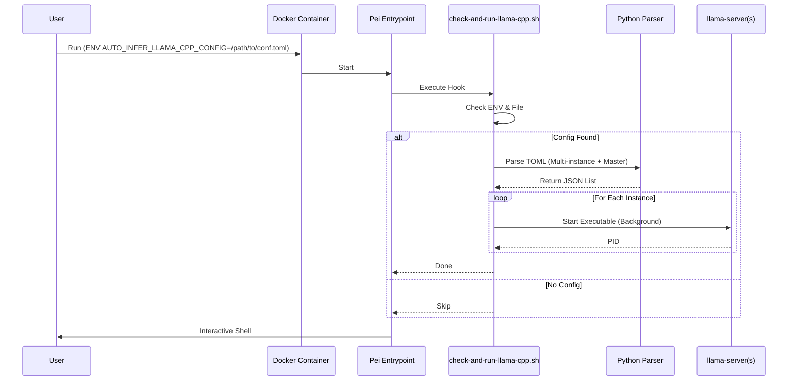

# Plan: Auto-Inference Llama.cpp Startup Script

## HEADER

- **Purpose**: Implement an automatic launcher for `llama.cpp` server instances upon container startup using a hierarchical TOML configuration file.
- **Status**: Draft
- **Date**: 2026-01-14
- **Dependencies**: 
  - `dockers/infer-dev/user_config.yml`
  - `dockers/infer-dev/container-scripts/`
  - `context/design/contract/def-llama-cpp-config-toml.md`
- **Target**: AI Engineers using `infer-dev` for model serving.

---

## 1. Purpose and Outcome

The goal is to automate the deployment of one or more `llama.cpp` server instances within the `infer-dev` container. By defining a `.toml` configuration file with a `[master]` section and global/instance hierarchy, and pointing to it via `AUTO_INFER_LLAMA_CPP_CONFIG`, the container will automatically parse the config and start the server processes during its entrypoint phase.

**Success Criteria:**
- A script `check-and-run-llama-cpp.sh` exists in the container.
- The script runs automatically on container startup.
- It detects `AUTO_INFER_LLAMA_CPP_CONFIG`.
- It parses the TOML file using an inline Python script (`tomllib`), handling:
    - `master.enable` (must be true to proceed).
    - `master.llama_cpp_path` (custom executable path).
    - Global defaults (`[instance.control]`, `[instance.server]`).
    - Specific instance overrides (`[instance.<name>.control]`, `[instance.<name>.server]`).
- It launches a `llama-server` process for each enabled instance in the background.

## 2. Implementation Approach

### 2.1 High-level flow

1.  **Trigger**: `pei-docker` entrypoint invokes `check-and-run-llama-cpp.sh`.
2.  **Check**: Verify `AUTO_INFER_LLAMA_CPP_CONFIG` exists.
3.  **Parse (Python)**:
    - Load TOML.
    - Check `master.enable`. Exit if false.
    - Extract `master.llama_cpp_path`.
    - Extract global defaults.
    - Iterate over instances.
    - Merge instance config with defaults.
    - Generate a JSON list of objects: `[{ "name": "llama3", "log_file": "...", "background": true, "gpu_ids": "0,1", "executable": "/path/to/llama-server", "cmd": ["--port", "8080", ...] }, ...]`.
4.  **Launch (Bash)**:
    - Iterate over the JSON list (using Python wrapper).
    - For each instance:
        - Check if enabled (already filtered by Python or double-check).
        - **GPU Handling**:
            - If `gpu_ids` is None or "all": Do not set `CUDA_VISIBLE_DEVICES`.
            - If `gpu_ids` is "none": Set `CUDA_VISIBLE_DEVICES=""`.
            - Otherwise: Set `CUDA_VISIBLE_DEVICES="{gpu_ids}"`.
        - Start the executable (`llama_cpp_path`) with provided arguments and env vars.
        - Redirect output to `log_file`.
        - Background (`&`) the process.
        - Print status: "Started [name] on port [port]... PID: [pid]".

### 2.2 Sequence diagram (steady-state usage)

## 3. Files to Modify or Add

- **dockers/infer-dev/container-scripts/check-and-run-llama-cpp.sh**:
  - Main logic. Includes inline Python script.
- **dockers/infer-dev/user_config.yml**:
  - Update `stage_2.custom.on_entry`.
- **dockers/infer-dev/examples/llama_config.toml**:
  - Sample configuration.

## 4. TODOs (Implementation Steps)

- [ ] **Create Script**: `dockers/infer-dev/container-scripts/check-and-run-llama-cpp.sh`
    - [ ] Implement env var check.
    - [ ] Write inline Python parser for hierarchical TOML with `master` section support.
    - [ ] Implement bash loop to launch processes from Python output using the correct executable path.
- [ ] **Register Script**: Update `dockers/infer-dev/user_config.yml` (Already done).
- [ ] **Documentation**: Update `dockers/infer-dev/examples/llama_config.toml`.
- [ ] **Verification**: Dry run/unit test the Python parser logic.
