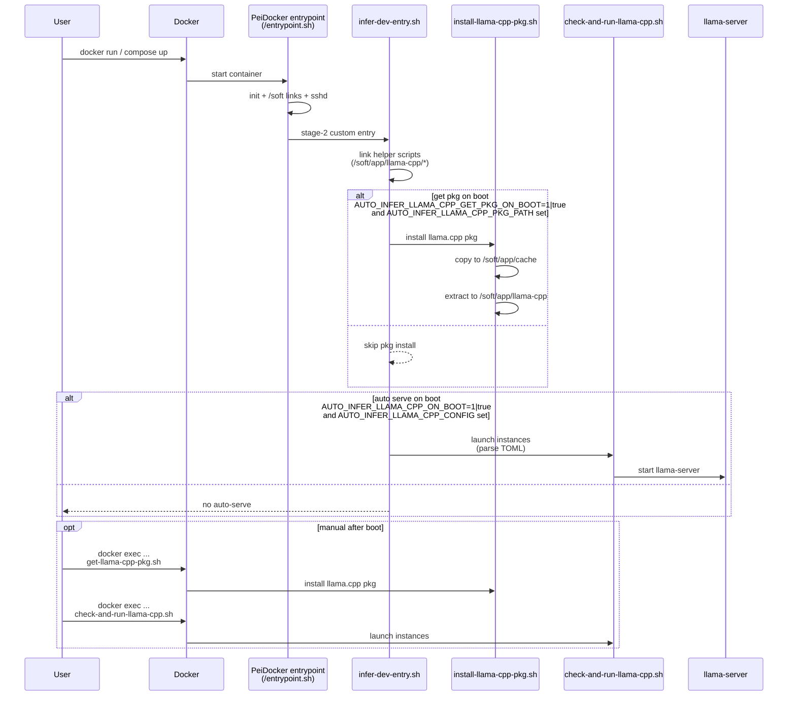

# infer-dev (Inference Development Container)

`dockers/infer-dev` provides a GPU-enabled “inference development” container: a persistent, SSH-accessible CUDA Ubuntu environment for interactively building and running local LLM inference stacks (not just a single service).

It is generated/configured via **PeiDocker** and uses a 2-stage image:
- **Stage 1** (`infer-dev:stage-1`): system layer (CUDA base, SSH, APT/proxy helpers).
- **Stage 2** (`infer-dev:stage-2`): app/dev layer (developer tools and runtime hooks).

## What it’s for

- Experimenting with `llama.cpp` and `vLLM` inside a consistent CUDA environment.
- Keeping work persistent via host-mounted volumes for code/data/workspace and local model storage.
- Optionally auto-starting one or more `llama-server` instances on container entry.

## Key features (recent work)

- **CUDA + NVIDIA GPU** support (Compose requests all GPUs).
- **Storage + mounts**
  - `storage.app` and `storage.data` use `image` storage (not host-mounted).
  - `storage.workspace` is host-mounted: `dockers/infer-dev/.container/workspace` → `/hard/volume/workspace`.
  - Models are mounted via `stage_2.mount` (example: `/data1/huangzhe/llm-models/GLM-4.7-GGUF` → `/llm-models/GLM-4.7-GGUF`). Do **not** mount the entire host model tree.
- **Port mapping**
  - Host `11980` → container `8080` (llama-server).
  - Host `11981` → container `8000` (vLLM OpenAI server).
  - Host `11899` → container `11899` (Claude telemetry proxy).
- **Optional auto-launch llama.cpp server**:
  - Set `AUTO_INFER_LLAMA_CPP_ON_BOOT=1` (or `true`) to enable auto-start on container boot.
  - Set `AUTO_INFER_LLAMA_CPP_CONFIG` to a TOML file to define one or more `llama-server` instances.
  - If `AUTO_INFER_LLAMA_CPP_ON_BOOT` is unset/false, nothing auto-starts; run `/soft/app/llama-cpp/check-and-run-llama-cpp.sh` manually after boot.
- **Optional on-boot llama.cpp package install**
  - Set `AUTO_INFER_LLAMA_CPP_PKG_PATH` to a mounted archive (`.tar`, `.tar.gz`/`.tgz`, `.zip`) containing:
    - `README*` at archive root
    - `bin/llama-server` and the required `bin/*.so*` in the same folder
  - Auto-install on boot is **off by default**. Enable with `AUTO_INFER_LLAMA_CPP_GET_PKG_ON_BOOT=1` (or `true`).
  - Manual install after boot: run `/soft/app/llama-cpp/get-llama-cpp-pkg.sh` (or `/soft/app/llama-cpp/install-llama-cpp-pkg.sh`).
- **Dev tooling in stage-2** (installed via `user_config.yml`): Pixi, Node.js, Bun, and agent CLIs (as configured).

## Quick start

```bash
docker compose build stage-2
docker compose up -d
```

## Container Workflow

On container start (`docker compose up`, `docker run`, `docker compose run`), the following happens:



1. **PeiDocker entrypoint** (`/entrypoint.sh`) runs the stage init:
   - creates `/soft/*` links (e.g., `/soft/workspace` → `/hard/volume/workspace`)
   - runs any configured stage-1/stage-2 `on_first_run` / `on_every_run` hooks
   - starts `sshd`
2. **Stage-2 custom entry** (`dockers/infer-dev/installation/stage-2/custom/infer-dev-entry.sh`) runs next:
   - always exposes helper scripts:
     - `/soft/app/llama-cpp/get-llama-cpp-pkg.sh` (manual llama.cpp bundle install)
     - `/soft/app/llama-cpp/check-and-run-llama-cpp.sh` (manual llama-server start)
   - **If** `AUTO_INFER_LLAMA_CPP_GET_PKG_ON_BOOT=1|true` **and** `AUTO_INFER_LLAMA_CPP_PKG_PATH=/path/to/pkg.(tar|tar.gz|tgz|zip)` is set: installs the llama.cpp bundle (copies to `/soft/app/cache/`, extracts to `/soft/app/llama-cpp/`)
   - **If** `AUTO_INFER_LLAMA_CPP_ON_BOOT=1|true` **and** `AUTO_INFER_LLAMA_CPP_CONFIG=/path/to/config.toml` exists: auto-starts llama-server instance(s)
3. **llama-server launcher** (`check-and-run-llama-cpp.sh`) behavior:
   - skips if `[master].enable=false`
   - picks `llama-server` from `[master].llama_cpp_path` (if set) or falls back to `/soft/app/llama-cpp/bin/llama-server` → `/hard/volume/workspace/llama-cpp/build/bin/llama-server` → `llama-server` (PATH)
   - launches each enabled `[instance.<name>]`, applying merged `server` args; if `gpu_ids` is set it exports `CUDA_VISIBLE_DEVICES` for that instance; logs go to `log_file`/`log_dir`

Manual serving (when `AUTO_INFER_LLAMA_CPP_ON_BOOT` is unset/false): run `/soft/app/llama-cpp/check-and-run-llama-cpp.sh` inside the container.

## llama.cpp inference

Example config: `dockers/infer-dev/model-configs/glm-4.7-q2k.toml` (GLM-4.7 Q2_K, sharded GGUF).

Run an auto-start container (publishes port `11980` and mounts the config directory):

```bash
docker compose run -d --service-ports --name infer-glm \
  -v "$PWD/dockers/infer-dev/model-configs:/model-configs:ro" \
  -e AUTO_INFER_LLAMA_CPP_ON_BOOT=1 \
  -e AUTO_INFER_LLAMA_CPP_CONFIG=/model-configs/glm-4.7-q2k.toml \
  stage-2 sleep infinity
```

Verify:

```bash
curl http://127.0.0.1:11980/v1/models
curl http://127.0.0.1:11980/v1/chat/completions -H 'Content-Type: application/json' -d 
{
  "model": "glm4",
  "messages": [{"role": "user", "content": "Hello"}],
  "max_tokens": 64
}
```

## vLLM inference (Pixi-Pack offline bundle)

This workflow is opt-in and designed to be **offline at runtime**:
- Build an offline bundle tar on the host (downloads once, cacheable).
- Mount it into `infer-dev` (recommended: under the mounted workspace).
- On container boot, extract + `pixi install --frozen` from the local `channel/`, then start vLLM.

Helpers inside the container:
- `/soft/app/vllm/install-vllm-offline.sh`
- `/soft/app/vllm/check-and-run-vllm.sh`

### 1) Build the offline bundle (host)

Default output goes to the mounted workspace: `dockers/infer-dev/.container/workspace/vllm-offline-bundle.tar`.

```bash
./dockers/infer-dev/host-scripts/build-vllm-bundle.sh
```

### 2) Start vLLM on boot (container)

Example config: `dockers/infer-dev/model-configs/vllm-qwen2-vl-7b.toml`.

```bash
docker compose run -d --service-ports --name infer-vllm \
  -v "$PWD/dockers/infer-dev/model-configs:/model-configs:ro" \
  -e AUTO_INFER_VLLM_BUNDLE_ON_BOOT=1 \
  -e AUTO_INFER_VLLM_BUNDLE_PATH=/hard/volume/workspace/vllm-offline-bundle.tar \
  -e AUTO_INFER_VLLM_ON_BOOT=1 \
  -e AUTO_INFER_VLLM_CONFIG=/model-configs/vllm-qwen2-vl-7b.toml \
  stage-2 sleep infinity
```

Verify (host-side):

```bash
curl http://127.0.0.1:11981/v1/models
curl http://127.0.0.1:11981/v1/chat/completions -H 'Content-Type: application/json' -d '{"model":"qwen2-vl-7b","messages":[{"role":"user","content":"Hello"}],"max_tokens":64}'
```

## Integrating with Claude Code

Claude Code speaks the **Anthropic** API, while `llama-server` speaks **OpenAI** API.
`infer-dev` can optionally start an in-container bridge:

- **LiteLLM** (Anthropic → OpenAI translation) on `AUTO_INFER_LITELLM_PORT` (default: `8010`)
- **Telemetry proxy** on `AUTO_INFER_LITELLM_PROXY_PORT` (default: `11899`) which stubs
  `POST /api/event_logging/batch` to keep Claude Code happy

### Quick start (in-container bridge)

Start a container with both llama.cpp auto-serve and the LiteLLM bridge enabled:

```bash
docker compose run -d --service-ports --name infer-glm \
  -v "$PWD/dockers/infer-dev/model-configs:/model-configs:ro" \
  -e AUTO_INFER_LLAMA_CPP_ON_BOOT=1 \
  -e AUTO_INFER_LLAMA_CPP_CONFIG=/model-configs/glm-4.7-q2k.toml \
  -e AUTO_INFER_LITELLM_ON_BOOT=1 \
  stage-2 sleep infinity
```

Then point Claude Code at the **proxy** endpoint (host-side):

```bash
export ANTHROPIC_BASE_URL=http://127.0.0.1:11899
export ANTHROPIC_API_KEY=sk-litellm-master
claude -p "Hello from local model!"
```

Notes:
- The bridge launcher is `/soft/app/litellm/check-and-run-litellm.sh`.
- If `AUTO_INFER_LITELLM_CONFIG` is unset (or missing), a default config is generated at
  `/soft/app/litellm/config.yaml` mapping common `claude-*` model names to `openai/glm4`
  via `http://127.0.0.1:8080/v1` (the in-container llama-server).
- To bridge Claude Code to vLLM instead, set:
  - `AUTO_INFER_LITELLM_BACKEND_BASE=http://127.0.0.1:8000/v1`
  - `AUTO_INFER_LITELLM_BACKEND_MODEL=qwen2-vl-7b` (or your served model name)
- Logs: `/tmp/litellm.log` and `/tmp/litellm-proxy.log`.

## Editing configuration (important)

PeiDocker projects can be re-created/regenerated, and `user_config.yml` may be overwritten during that process. To keep your changes durable:

1. Edit `dockers/infer-dev/user_config.persist.yml`
2. Copy it over the active config before running PeiDocker:
   ```bash
   cp dockers/infer-dev/user_config.persist.yml dockers/infer-dev/user_config.yml
   ```

After changing `user_config.yml` or anything under `dockers/infer-dev/installation/`, you must run:

```bash
pei-docker-cli configure -p dockers/infer-dev
```

Otherwise the generated artifacts (notably `dockers/infer-dev/docker-compose.yml`, and optionally `merged.*`) will be stale. See `dockers/infer-dev/PEI-DOCKER-USAGE-GUIDE.md` for details.

To use the merged single-image workflow:
```bash
./build-merged.sh
./run-merged.sh --shell
```

Note: do not commit secrets (`.env`, tokens, private keys). Use `env.example`/config templates instead.
